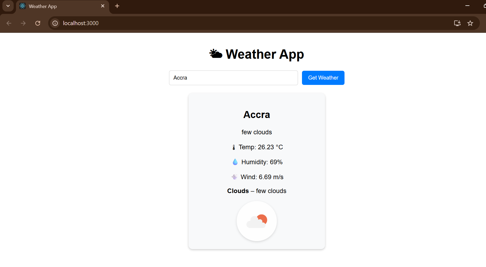
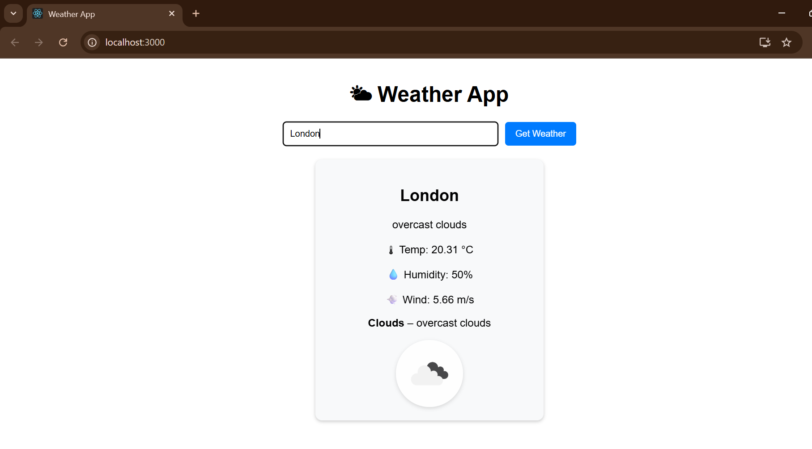
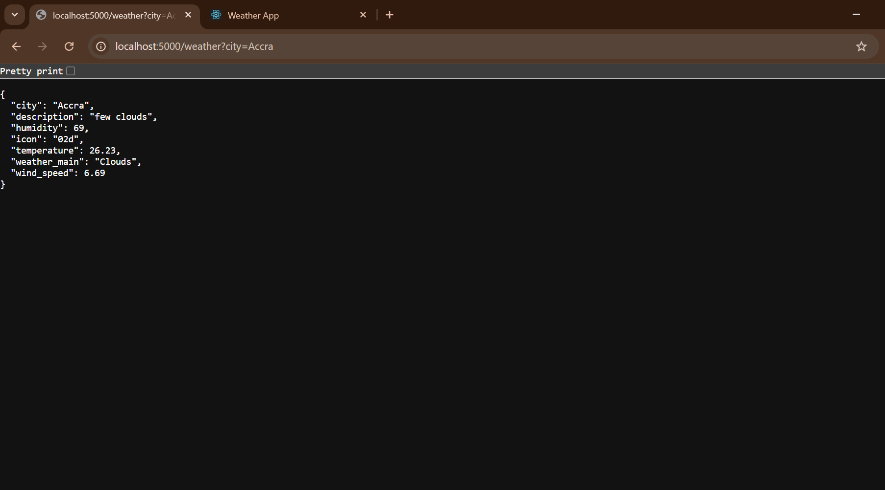
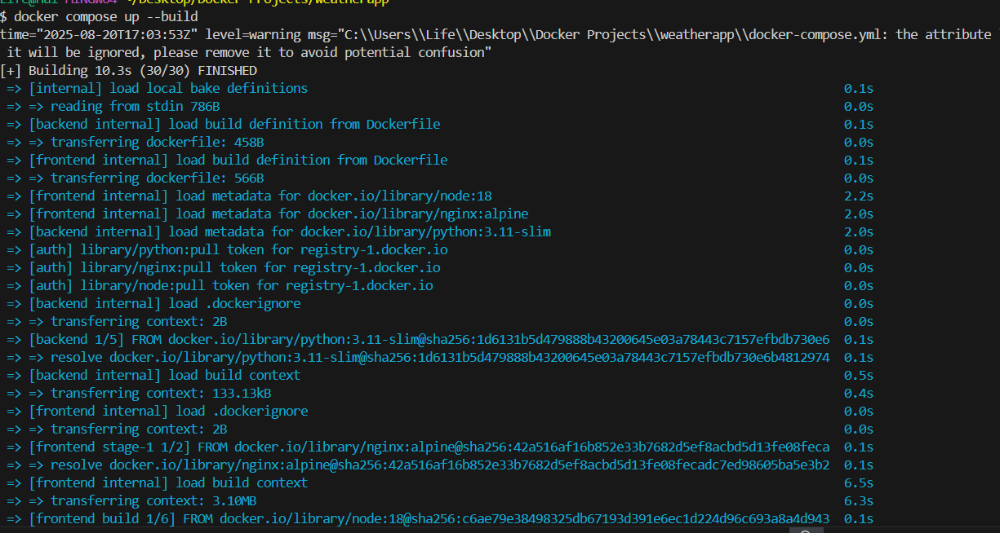
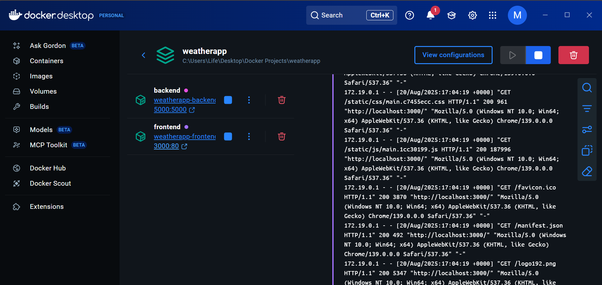

# 🌤 Weather App (React + Flask + Docker Compose)

A simple containerized weather app built with **React (frontend)** and **Flask (backend)**.  
The app fetches live weather data from the OpenWeather API.

---

## ⚡ Features

- Search weather by city name
- Displays temperature, humidity, wind speed, and conditions
- React frontend + Flask backend architecture
- Dockerized for easy deployment
- Ready for AWS EC2 deployment with Terraform (coming soon 🚀)

---

## 📂 Project Structure

```
weather-app/
│── backend/ # Flask backend
│ ├── app.py
│ ├── requirements.txt
│ └── Dockerfile
│
│── frontend/ # React frontend
│ ├── src/App.js
│ ├── package.json
│ └── Dockerfile
│
│── docker-compose.yml
│── .env
```

# 🛠 Prerequisites

- Docker
- Docker Compose
- An OpenWeather API Key

# ⚙️ Setup

Clone the repo:

```
git clone https://github.com/yourusername/weather-app.git
cd weather-app
```

Copy the example env file:

```
cp .env.example .env
```

Edit .env and add your API key:

```
OPENWEATHER_API_KEY=your_api_key_here
FLASK_ENV=development
```

# ▶️ Run locally with Docker Compose

```
bash: docker compose up --build
```

- Frontend → http://localhost:3000

- Backend → http://localhost:5000/weather?city=Accra

## 📸 Screenshots

### Running App





### Dockerized Frontend + Backend Running




# 🤝 Contributing

PRs are welcome!
If you'd like to contribute, please fork the repo and open a pull request.

# 📄 License

MIT License – feel free to use this project as you like.
